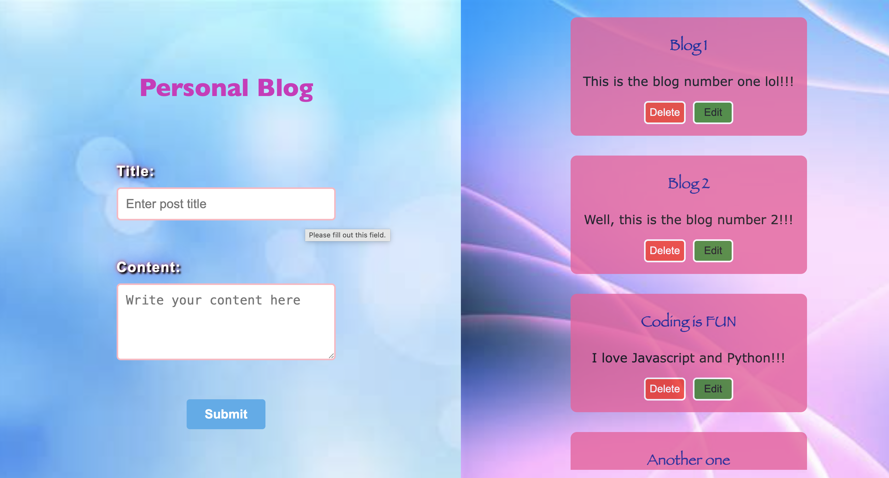

# Personal Blog

A simple project that allows users to create, display, edit and delete posts, with data stored in the browser using localStorage.

## Features

- Create new posts with title and content
- Dispaly all posts on the page
- Editing the existing posts
- Deleting the posts
- Form validation (title & content required)
- Success / error messages
- Local Storage Implementation

## Resources

MDN, W3schools, AI tools, freeCodeCamp

